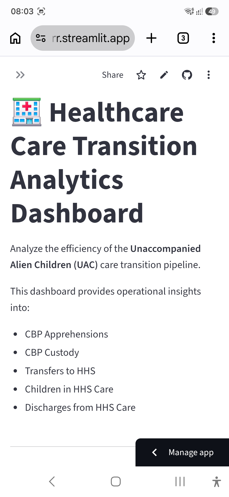
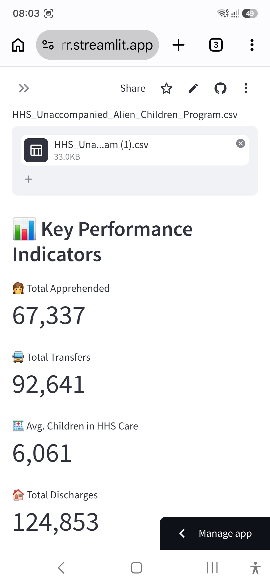
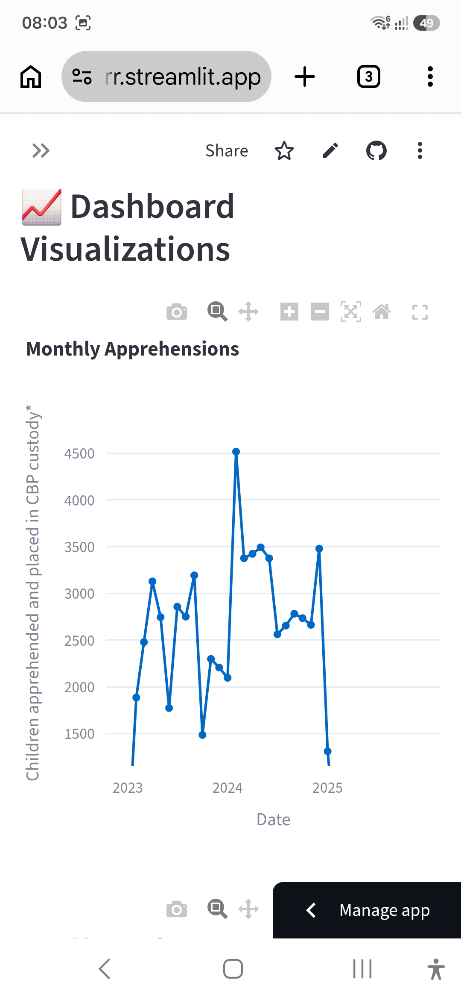
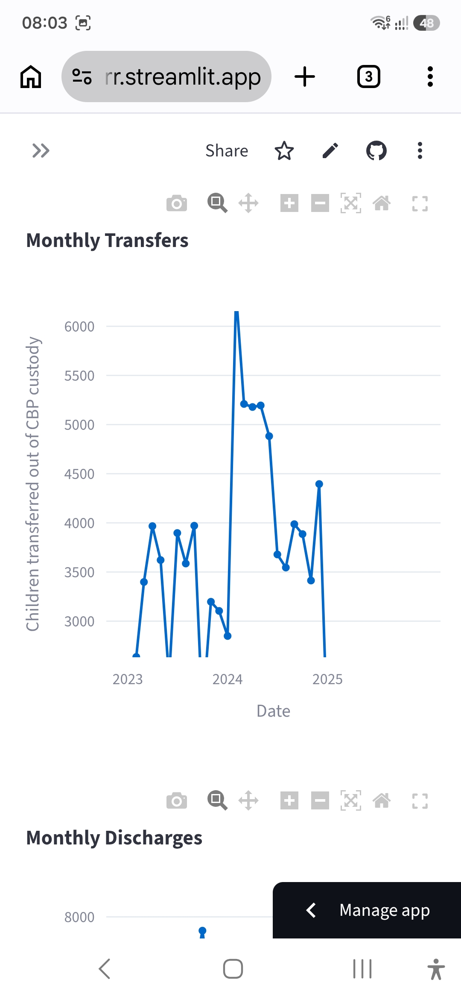
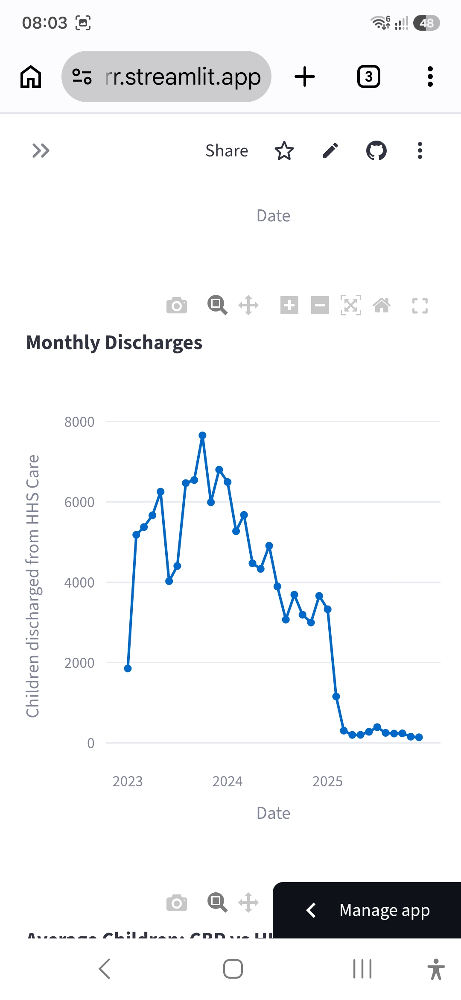
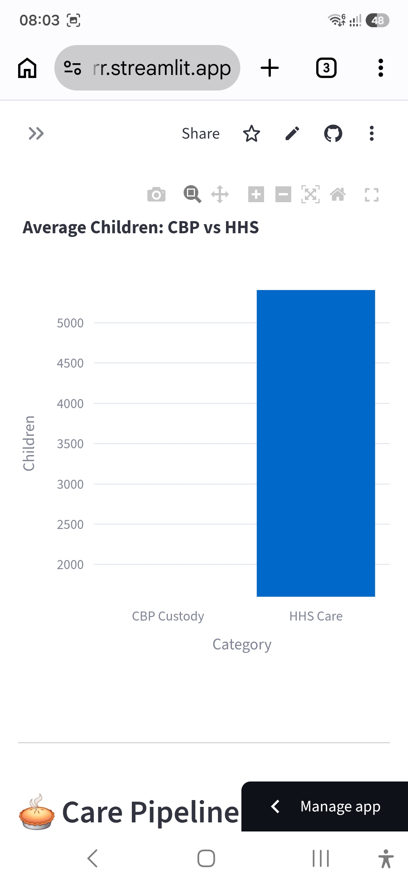
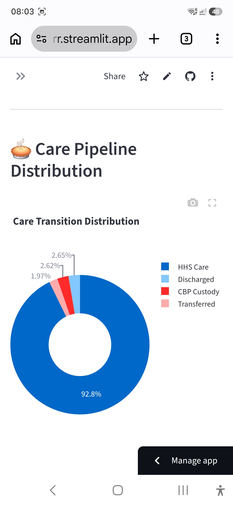
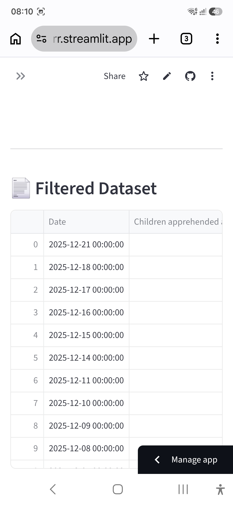

# Healthcare Care Transition Analytics


- Independently designed and developed an end-to-end healthcare analytics application to analyze patient care transition and discharge workflows.
- Performed data cleaning, preprocessing, exploratory data analysis (EDA), and feature engineering on operational healthcare datasets using Python and Pandas.
- Designed interactive dashboards and visual analytics to identify trends, operational bottlenecks, and key performance indicators (KPIs).
- Implemented reproducible data processing workflows and modular Python code for efficient analysis and visualization.
- Built an interactive Streamlit application with dynamic filtering, downloadable reports, and user-driven exploration of healthcare data.
- Version-controlled the complete project using Git and GitHub and deployed the application for public access using Streamlit Community Cloud.
- Documented the project with clear technical documentation, demonstrating independent problem-solving, software development, and analytical reasoning.

## Project Overview
This project analyzes the efficiency of the Unaccompanied Alien Children (UAC) care transition process using Python, Pandas, Matplotlib, and Streamlit.

The analysis focuses on:

- CBP Apprehensions
- Children in CBP Custody
- Transfers from CBP to HHS
- Children in HHS Care
- Discharges from HHS Care

## Objectives

- Analyze monthly trends
- Measure transfer efficiency
- Measure discharge efficiency
- Detect operational bottlenecks
- Build an interactive Streamlit dashboard

## Technologies Used

- Python
- Pandas
- NumPy
- Matplotlib
- Streamlit

## Key Performance Indicators (KPIs)

- Transfer Efficiency Ratio
- Discharge Efficiency Ratio
- Monthly Apprehension Trend
- Monthly Transfer Trend
- Monthly Discharge Trend

## Repository Structure

```
Healthcare-Care-Transition-Analytics/
│
├── app.py
├── analysis.ipynb
├── requirements.txt
├── README.md
└── data/
```

## Future Improvements

- Interactive dashboard
- Predictive analytics
- Automated reporting
- Government stakeholder reporting

## Author

Neha Malav
## 🌐 Live Demo


## 📸 Dashboard Preview

### Dashboard Overview


### KPI Cards


### Monthly Apprehensions


### Monthly Transfers


### Monthly Discharges


### CBP vs HHS Comparison


### Care Pipeline Distribution


### Filtered Dataset


### Upload Dataset


### KPI Dashboard


### Monthly Apprehensions


## 📊 Key Insights

- CBP apprehensions fluctuated significantly over the observed period, indicating changing migration patterns.
- Transfer efficiency from CBP to HHS remained high overall, demonstrating timely movement into HHS care.
- Discharge efficiency remained relatively low, suggesting children typically stay in HHS care for extended periods.
- Monthly trends revealed seasonal variations in apprehensions and transfers.
- Interactive filtering enables stakeholders to analyze operational performance across different time periods.
- 
## 💡 Recommendations

- Improve discharge planning to reduce the average length of stay in HHS care.
- Monitor transfer efficiency continuously to prevent bottlenecks between CBP and HHS.
- Use predictive analytics to forecast future care demand.
- Develop automated alerts for unusual increases in apprehensions or delays in transfers.
- Expand the dashboard with regional and state-level analytics for better decision-making.
- 
- ## 🚀 Future Enhancements

- Predictive analytics using Machine Learning
- Interactive geographic maps
- Real-time data integration
- Executive summary dashboard
- Automated PDF reporting
- Advanced KPI monitoring
- 

**Streamlit App:**  
https://healthcare-care-transition-analytics-ned5x4whmtey76yaxl4orr.streamlit.app/

## 📓 Kaggle Notebook

https://www.kaggle.com/code/nehamalav/nehaproject8d1a


## 👩‍💻 Author

**Dr. Neha Malav**


